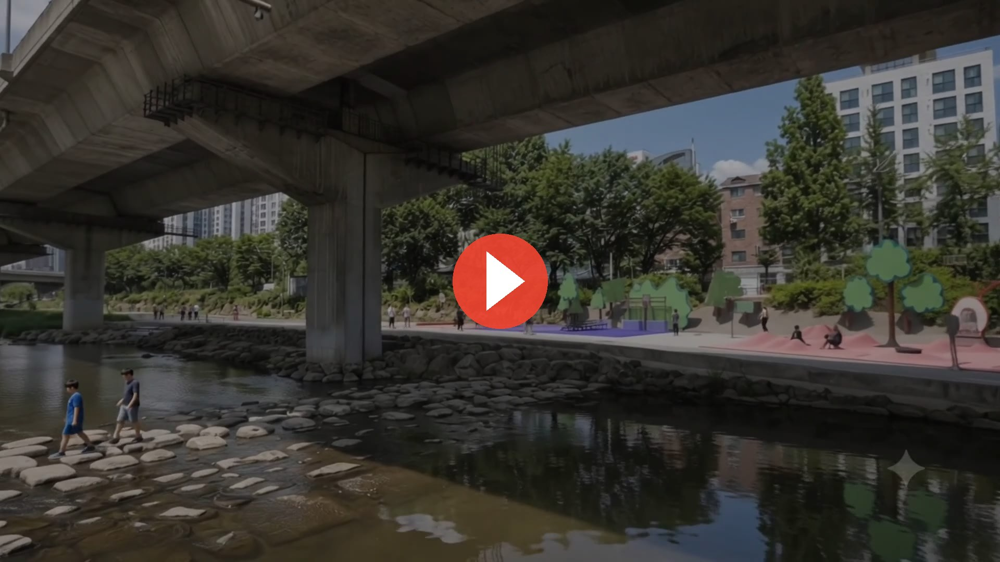

# Tree to Forest — An Urban Pop-up Along Hongjecheon Stream

[한국어](README.md) | **English**

Driving the extraordinary into an ordinary path. Six basketball nodes scattered along
Hongjecheon Stream propose **an urban forest where young single-person households can
stay without spending**.


> **Core proposition — dismantling the hierarchy of the hoop**
> In conventional basketball space, play, spectators and sightlines all converge on a
> single hoop. This project dissolves that hierarchy and scatters it across many trees,
> each different in form, material and scale. When the hoop is no longer the sole apex,
> anyone passing by can enter and stay. **From a tree to a forest.**

## Preface

Developed for the *Spatial Culture Content Planning* course, Doctoral Program in Space
Design, Graduate School of Kookmin University. Starting from the broad theme "City,
Space and People," the subject was narrowed through four keywords:
`Basketball × Youth × The Extraordinary × A Place to Stay`.

One question drives it: **why is there no extraordinary urban space where a young person
can stay for a long time — without consuming, using their body, connecting naturally
with strangers?**

This is a **competition-style proposal**, not a built installation. Site, program,
material and operation are specified at a level that could be realised as-is given
budget and opportunity.

## Video — final render

[](https://banhangsim.github.io/hongje-tree-to-forest/video.html)

▶ **[Play the video (23 s)](https://banhangsim.github.io/hongje-tree-to-forest/video.html)** — or just click the image.
[Download the MP4](assets/video/tree-to-forest.mp4)

> GitHub READMEs do not turn an in-repo mp4 into a player — clicking it downloads the file.
> Playback is therefore linked to the player on GitHub Pages.

## Gallery

- **GitHub Pages:** https://banhangsim.github.io/hongje-tree-to-forest/

All six nodes and the video on a single page. One self-contained HTML file, no dependencies.

## Why here, why them

### Target — not university students, but young working single-person households

University students already have a social space: clubs, campus, classes provide a base
for loose connection. The gap opens after leaving that fence.

| | Home | Social space | Work |
|---|---|---|---|
| University student | Home | **University ✓** | → entering society |
| Young working single household | Home (alone) | **None ← the gap this project fills** | Company (work only) |

### Data — satisfied, yet lonely

Seoul Institute survey of single-person households (face-to-face, n = 3,079).

| Indicator | Figure |
|---|---|
| "Nomadic" type among young single households | **60%** |
| Loneliness among the nomadic type | **62.5%** |
| Social isolation among the nomadic type | **14.0%** |
| Preference for community space (1 in 5) | **20.5%** |
| Life satisfaction — highest of any generation | **94%** |
| And yet, feel lonely | **58.9%** |

Because it looks fine from the outside, it stays hidden. That is the real reason a
place to stay is needed.

### What is missing is not friends, but weak ties

Strong ties — family, old friends — exist but are rarely seen; each meeting costs
planning, travel and emotional effort. The missing layer is **weak ties**: the regular
shop, the recurring face, the stranger you played alongside. The layer Granovetter
(1973) identified as contributing to information, emotional stability and belonging.

→ Not a place that makes friends for you, but a place **where loose ties can occur**.

### Hence basketball

Street pickup basketball produces exactly that solidarity — without consumption,
without curation, without hierarchy. Three papers ground this in
[docs/01-thesis.md](docs/01-thesis.md).

### Hence Hongjecheon

The Han River is already extraordinary — a stage you deliberately travel to. An inner-city
stream sits on the path of the evening walk, the coffee run, the weekend — **a place you
pass and stay at**.

Two filters narrowed the site: ① does street basketball culture already exist there
② is it an everyday-scale stream rather than Han-River-scale.

```
Seongbukcheon · Hongjecheon · Jungnangcheon
   │
   ├─ ① existing courts ──→  Hongjecheon · Jungnangcheon   (Seongbukcheon ✗ — no basketball base)
   │
   └─ ② stream scale   ──→  Hongjecheon ✓                  (Jungnangcheon ✗ — Han-River wide)
```

**Hongje Rivers**, an active local community, adds the operational base.

## Six nodes

Scattered like a forest along a 144 m section.
★ denotes not intensity of play but the **"playing → staying" spectrum**.

| Node | Intensity | One line | Status |
|---|---|---|---|
| Lobby | — | The door into the forest | Rendered |
| Tournament Court | ★★★ | The court we watch together | Rendered |
| 3D Court | ★★ | Between rule and deformation | Rendered |
| Trampoline Court | ★★ | Basketball that bounces back | Rendered |
| Reading Court | ★ | A place to stay without spending | Rendered · hero |
| H.O.R.S.E. Court | ★★★ | Connected without being together | Rendered · conceptual climax |

Detail: [docs/02-nodes.md](docs/02-nodes.md)

|  |  |
|---|---|
|  **Lobby** |  **Tournament Court** |
|  **3D Court** |  **Trampoline Court** |
|  **Reading Court** |  **H.O.R.S.E. Court** |

### Program principle — it does not make you play basketball

```
★★★  You play            →   ★★  You can't quite play      →   ★  You stay with basketball
     Tournament · HORSE        Trampoline · 3D Court            Reading · rest
     the few who really run    slope and rebound void skill     watching · resting · reading
```

A space that **includes** serious players, but is not **only for** them.
The lower the threshold, the longer the stay — onlooker → spectator → participant.

## Documents

- [01 — Thesis and research base](docs/01-thesis.md)
- [02 — The six nodes](docs/02-nodes.md)
- [03 — Design log: from midterm to final](docs/03-design-log.md)

## Source material

- [Midterm presentation (PDF)](assets/pdf/midterm-presentation.pdf) — May 2026
- [Final presentation (PDF, 31 pp.)](assets/pdf/final-presentation.pdf) — 22 Jun 2026, v2
- [Final render video (MP4)](assets/video/tree-to-forest.mp4)

## Operation

| | |
|---|---|
| Pop-up period | April–October (~7 months); winter excluded |
| Operator | Hongje Rivers — an already active local community |
| Safety | Unstaffed outdoor standard — vandalism and wind: steel/perforated plate, gooseneck, anchoring |
| Sponsor | Red Bull and others — lobby drinks and goods offset operating cost |

## Contribution as research

1. **A new court typology** — a court you stay at without playing; staying itself is designed.
2. **Weak-tie devices** — spatial and interaction principles, e.g. asynchronous HORSE.
3. **A method for the extraordinary within the everyday** — inserting the extraordinary into the leisure-everyday path of an inner-city stream.

## Author

Yangwook Yu (Banhangsim) — Doctoral candidate, Space Design, Kookmin University Graduate
School · Banhangsim Design Studio
Student ID D2026037 · Final presentation 22 June 2026

## License

Documents, images and video may be viewed and cited with attribution. Contact for
commercial reuse.
