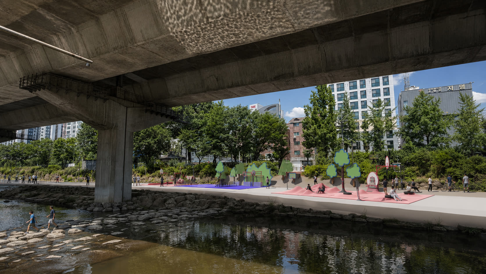
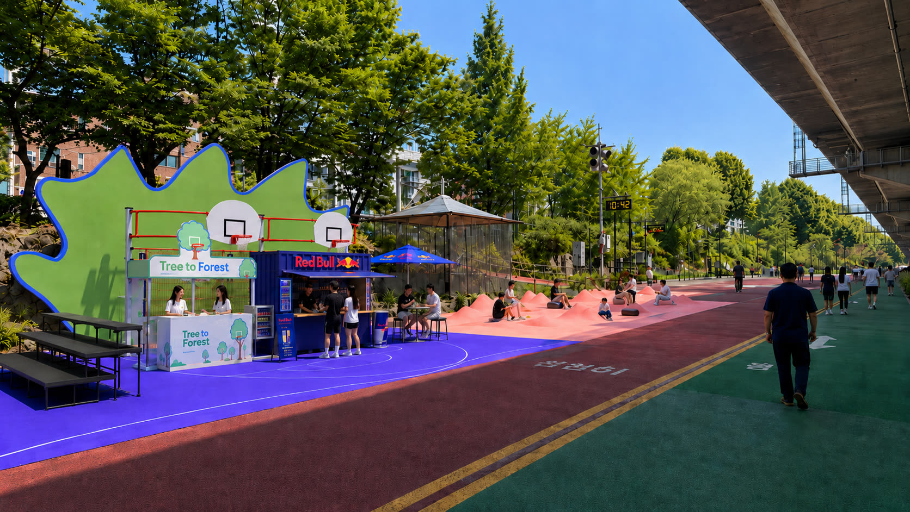
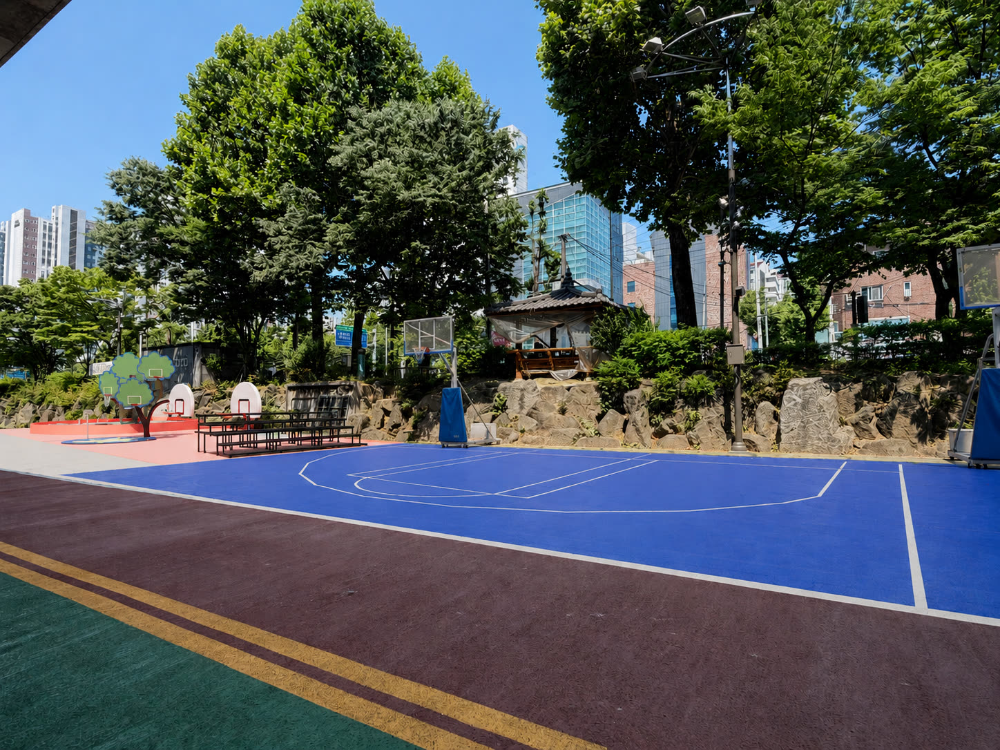
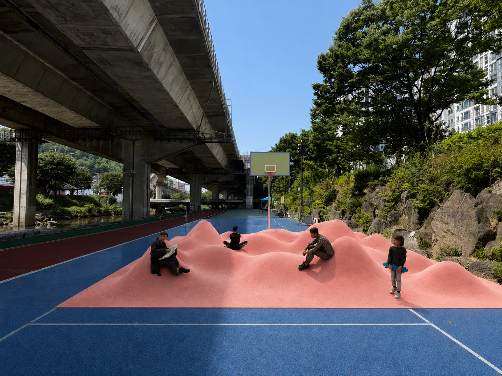
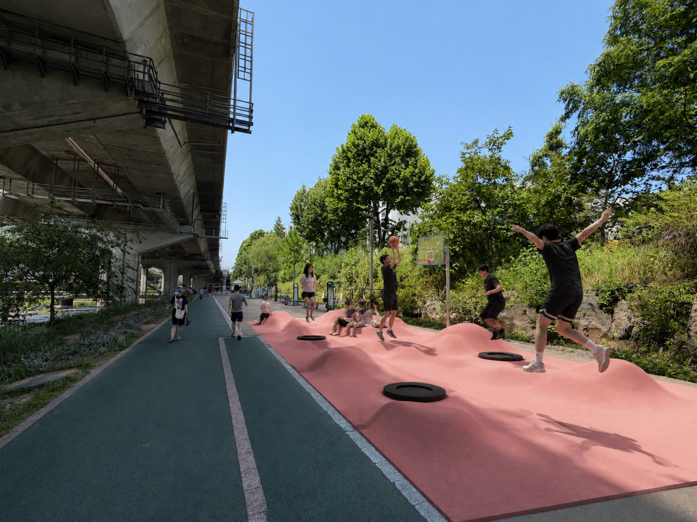
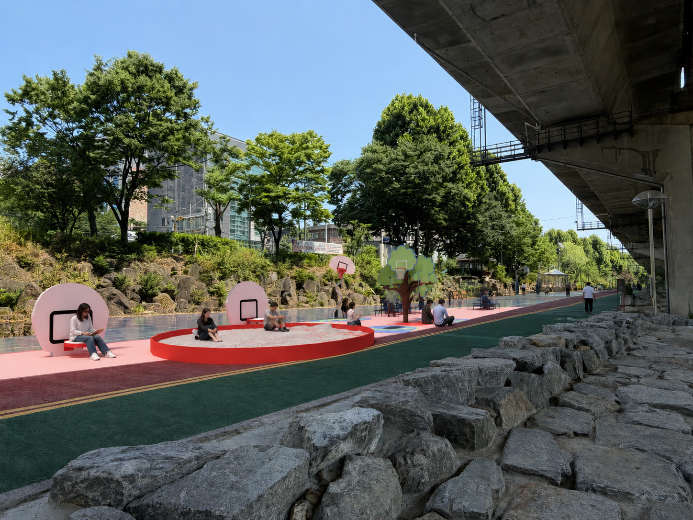
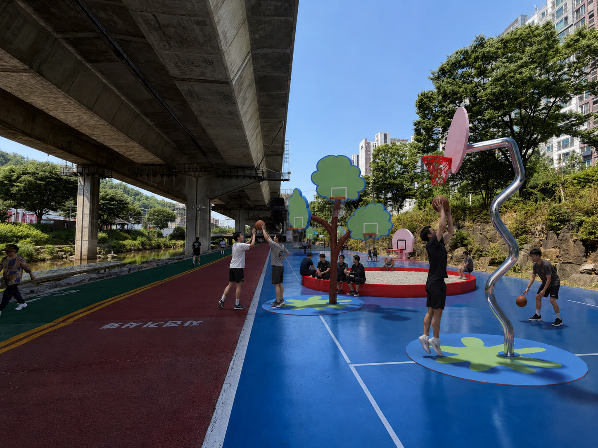

# 02 — 여섯 개의 노드

[← README](../README.md)

## 배치 원리

144m 단면. 여섯 노드가 하천을 따라 숲처럼 분산된다.
하나의 큰 코트가 아니라 흩어진 여러 그루 — 지나치다 한 그루에 머물고, 또 다른 그루로 옮겨가는 동선.



```
로비 ── 토너먼트 코트 ── 3D 코트 ── 트램펄린 코트 ── 독서 코트 ── H.O.R.S.E. 코트
 —          ★★★           ★★          ★★            ★             ★★★
운영        함께 본다     규칙과 변형   튀어 오른다   소비 없이 머문다   비동기 연결
```

## 강도 체계 — ★는 '하기 → 머물기' 스펙트럼

농구 실력이나 운동 강도의 등급이 아니다. **얼마나 '하는가'에서 얼마나 '머무는가'로** 가는 축이다.

| ★★★ 농구를 한다 | ★★ 농구가 (일부러) 안 된다 | ★ 농구에 머문다 |
|---|---|---|
| 토너먼트 · HORSE | 트램펄린 · 3D 코트 | 독서 · 휴식 |
| 실제로 뛰는 소수의 적극 참여자. 길거리 농구의 진짜 장면 | 진지한 농구가 불가능한 환경 = 의도된 진입장벽 제거. 실력과 무관하게 누구나 들어와 이미지를 소비한다 | 농구장 안에서 그냥 머문다 — 구경·휴식·독서 |

진입장벽을 낮출수록 머무름은 커진다 — **구경꾼 → 관중 → 참여자**로 자연스럽게 이동.

진지한 농구인을 **포함하는** 공간이지만, 진지한 플레이어**만을 위한** 공간이 아니다.
누구나 농구라는 '이미지'를 소비하며 그 안에 머문다.

---

## 01. 로비 (Lobby) — "숲으로 들어가는 문"

강도 —



| | |
|---|---|
| **Material** | 카운터: 우드 + 메탈 / 사이니지: 분체도장 메탈 / 바닥: 우레탄 |
| **가구·집기** | 인포메이션 카운터 · 음료 냉장고(스폰서) · 굿즈 선반 |
| **프로그램** | 안내·입장 · 음료 제공 · 굿즈 · 팝업 타이틀 소개 |

숲의 입구로서 환대의 톤. 운영·스폰서 접점이 여기 모인다.

---

## 02. 토너먼트 코트 — "함께 보는 코트"

강도 ★★★



| | |
|---|---|
| **Material** | 코트면: 우레탄 / EPDM · 백보드: 강화유리 또는 스틸(정규) · 라인마킹: 3x3 공식 규격 |
| **가구·집기** | 양측 관중석(스탠드/단) · 스코어보드 |
| **프로그램** | 3x3 시합 · 픽업게임 · 관전 · Hongje Court Day 토너먼트 |
| **치수** | 3x3 공식 규격 하프코트 |

구경꾼 → 관중 → 참여자 전환의 무대. 여섯 노드 중 유일하게 '정규'가 성립하는 곳이며,
나머지 다섯은 이 정규에서 얼마나 벗어나는가로 정의된다.

---

## 03. 3D 코트 — "규칙과 변형 사이"

강도 ★★



| | |
|---|---|
| **Material** | 바닥: 모핑 굴곡면 (주황-빨강 타탄/우레탄) · 높낮이·완급 존이 있는 지형 · 정규 골대 2개 |
| **가구·집기** | (옵션) 코트 위 기둥/가로등 모티프 |
| **프로그램** | 굴곡 위 비일상 플레이 |
| **레퍼런스** | Inges Idee, *Curved Basketball Court 3D²* (뮌헨, 2006) |

**설계 의도 — 진지한 농구를 일부러 어렵게.** 굴곡 위에선 실력이 무의미해져, 누구나 동등하게
시도하고 머문다. 정규 규칙과 변형된 지형 사이의 역설이 창의적 플레이를 유도한다.

위계 해체의 수단은 **재질**이다.

---

## 04. 트램펄린 코트 — "튀어 오르는 농구"

강도 ★★



| | |
|---|---|
| **Material** | 트램펄린 매트 · 스프링 · 안전 펜스 · 충격 흡수 패드 |
| **가구·집기** | 낮은/특수 높이 골대 |
| **프로그램** | 점프 슛·덩크 체험 · 놀이형 농구 |

**설계 의도 — 점프로 슛이 흐트러지는 환경.** 잘하는 사람도 초보가 된다 → 누구나 동등하게 논다.
신체의 비일상 — 평소와 다른 중력의 농구.

---

## 05. 독서 코트 — "소비 없이 머무는 곳" · hero

강도 ★



| | |
|---|---|
| **Material** | 거대 림: 림을 스케일업한 스틸 원형 구조 · 그물 자리: 메쉬망(짱짱한 인장 매트리얼, 트램펄린 유사) · 사람이 앉거나 누울 수 있는 면 |
| **가구·집기** | 책꽂이 · 쿠션 / 러그 · (옵션) 그늘 캐노피 |
| **프로그램** | 독서 · 휴식 · 누워있기 |

본 프로젝트 **"머물곳"** 명제를 형태로 가장 직접 구현하는 hero 공간.
림을 사람이 앉을 수 있는 크기로 키우는 것 — 위계 해체의 수단은 **스케일**이다.
농구의 부품을 가구로 바꾸는 순간, 코트는 소비 없이 존재 가능한 장소가 된다.

---

## 06. H.O.R.S.E. 코트 — "함께 없어도 연결된다" · 개념적 클라이맥스

강도 ★★★



| | |
|---|---|
| **Material** | 지그재그 기둥 골대 (= RIVERS 물결 기둥) · 나무형 군집 골대 (= Arbre à Basket형) · 골대당 1개의 림 |
| **가구·집기** | 골대별 디스플레이 스크린 · AI 트래킹 카메라 |
| **프로그램** | **AI 비동기 HORSE** |

AI가 사용자 동작을 트래킹해 HORSE 게임을 진행한다. 사람이 동시에 없어도, 이전 사용자의
행동을 기록 → 다음 사용자가 클리어하는 구조.

**핵심 개념 — 시공간이 어긋나도 연결된다.**
혼자 와도 이전 사람의 플레이와 겨루고, 내 플레이가 다음 사람에게 남는다.
비동기 도시 생활에 맞춘 '느슨한 연대'의 새로운 형식 — 외로움을 없애기보다, 가볍게 연결될
계기를 만든다.

위계 해체의 수단은 **형태**다 — 하나의 골대 대신, 형태가 제각각인 여러 그루.

---

## 골대 형태·재료 기준

무인 야외 = 반달리즘·바람·관리 기준.

| 부위 | 옵션 |
|---|---|
| **백보드** | 스틸/타공판 (무인 야외 표준) · 강화유리 (정규 토너먼트) · 색면 아크릴 (디자인 임팩트) |
| **기둥** | 구즈넥 (공원 표준) · 분체도장강 (검정 사각) · 커스텀 — 지그재그·나무 |
| **바닥** | 우레탄 (standard) · EPDM 고무 · mirror · 메쉬망 · 모핑 타탄 (3D) |

## 위계 해체의 세 수단 요약

| 수단 | 노드 | 조작 |
|---|---|---|
| **재질** | 3D 코트 | 평평한 코트면을 굴곡으로 |
| **스케일** | 독서 코트 | 림을 앉을 수 있는 크기로 |
| **형태** | HORSE 코트 | 하나의 골대를 지그재그·나무 군집으로 |

## 열린 과제

- **반납대에 해당하는 출구 노드** — 로비가 입구라면, 경험을 마치고 나가는 지점의 형식은 아직 없다.
- **비동기 HORSE의 실제 트래킹 정확도** — 야외 조도·다중 인원 환경에서의 검증 미실시.
- **7개월 팝업 후의 존속** — 철거인가, 상설화인가, 다른 하천으로의 이식인가.
